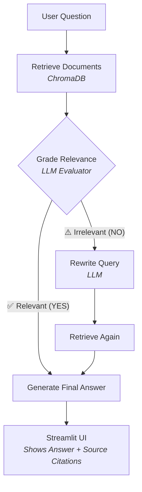

# 📚 Corrective RAG (CRAG) with LangGraph & Ollama


A robust Retrieval-Augmented Generation (RAG) system that **evaluates its own retrieval quality** and automatically **self-corrects** by rewriting user queries when the retrieved context is insufficient. 100% local, private, and open-source.

---

## ✨ Key Features

* **Corrective RAG Architecture**: Implements a self-evaluating loop. If retrieved documents are irrelevant, the system uses an LLM to reformulate the query and search again before generating an answer.
* **100% Local Privacy**: Runs entirely on your machine using Ollama (Llama 3.2) and local HuggingFace embeddings (`BAAI/bge-small-en-v1.5`). No API keys required.
* **Multi-Document Management**: Upload, index, filter, and delete multiple PDFs independently. Search across all documents or scope retrieval to specific files.
* **Source Citations**: Answers include exact citations, displaying the source document, page number, and text snippet used to generate the response.
* **Modern Chat UI**: Sleek, theme-adaptive Streamlit frontend with real-time status indicators, chat history, and visual badges for the retrieval grading process.
* **Vector Storage**: Persistent local vector database using ChromaDB.

---

## 🏗️ Architecture



---

## 🚀 Quick Start Guide

### 1. Prerequisites
* **Python 3.10+**
* **Ollama** installed and running on your system ([Download Ollama](https://ollama.com/download))

### 2. Pull the LLM Model
Open a terminal and pull the Llama 3.2 model:
```bash
ollama pull llama3.2
```

### 3. Install Dependencies
Clone the repository and set up your virtual environment:
```bash
git clone https://github.com/neerajguduru/Corrective-RAG.git
cd Corrective-RAG
python -m venv venv
source venv/bin/activate  # On Windows: venv\Scripts\activate
pip install -r requirements.txt
```

### 4. Configuration
Create a `.env` file from the example template:
```bash
cp .env.example .env
```
*(Optional: Tweak `TOP_K` in the `.env` file to retrieve more or fewer chunks per query).*

### 5. Run the Application
You will need two terminals.

**Terminal 1: Start the Backend API (FastAPI)**
```bash
source venv/bin/activate
uvicorn app.main:app --reload
```

**Terminal 2: Start the Frontend UI (Streamlit)**
```bash
source venv/bin/activate
streamlit run frontend/app.py
```

The UI will automatically open in your browser at `http://localhost:8501`.

---

## 📖 How to Use

1. **Upload Documents**: Open the left sidebar and upload one or more PDFs. They will be chunked, embedded, and saved to the local ChromaDB automatically.
2. **Filter Search (Optional)**: Select specific documents in the sidebar dropdown to restrict the AI's knowledge to only those files.
3. **Ask Questions**: Use the chat bar at the bottom.
4. **View the Magic**: Watch the status box to see if the AI graded the initial retrieval as **Relevant** or **Insufficient** (triggering a query rewrite).
5. **Verify Sources**: Expand the "Source Citations" box below any answer to see the exact text snippets and page numbers the AI used.

---

## 📂 Project Structure

```text
Corrective-RAG/
├── app/
│   ├── api/routes.py         # FastAPI endpoints (/chat, /upload, /documents)
│   ├── graph/                # LangGraph workflow definitions
│   │   ├── nodes.py          # Retrieve, Grade, Rewrite, Generate nodes
│   │   ├── state.py          # Shared state definition
│   │   └── workflow.py       # Graph compilation and routing logic
│   ├── ingestion/            # PDF parsing and chunking pipeline
│   ├── llm/model.py          # Ollama model instantiation
│   ├── prompts/              # System prompts for grading, rewriting, generating
│   └── retrieval/            # ChromaDB and HuggingFace embeddings
├── data/
│   ├── chroma_db/            # Persistent vector database (auto-generated)
│   └── documents/            # Stored PDFs (auto-generated)
├── frontend/
│   └── app.py                # Streamlit Chat Interface
├── requirements.txt          # Python dependencies
└── .env.example              # Environment variables template
```

---

## 🔮 Future Roadmap

- [ ] Hybrid Retrieval (Vector + BM25 keyword search)
- [ ] Cross-Encoder Reranking (e.g., MS-MARCO) for higher precision
- [ ] Web Search Fallback (Tavily/DuckDuckGo) when documents lack answers
- [ ] Multi-modal support (images and tables in PDFs)