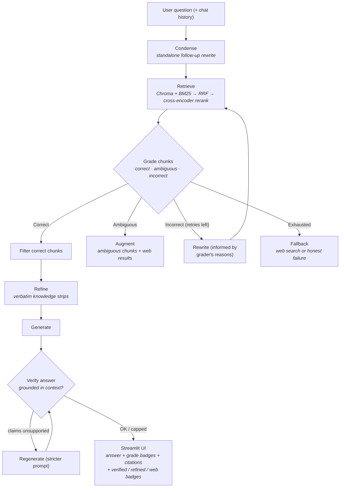

# Corrective RAG (CRAG) with LangGraph & Ollama


A robust Retrieval-Augmented Generation system that **grades its own retrieval
quality chunk-by-chunk**, self-corrects by rewriting queries and merging web
results, distills the context to just the sentences that matter, and **verifies
its own answers for grounding** before showing them. 100% local, private,
open-source — no paid API keys required.

---

## Key Features

* **Faithful CRAG loop**: per-chunk grading into three tiers — *Correct /
  Ambiguous / Incorrect* — with distinct corrective actions for each (based on
  the [CRAG paper](https://arxiv.org/abs/2401.15884)).
* **Hybrid retrieval**: dense (ChromaDB) + sparse (BM25) fused with Reciprocal
  Rank Fusion, then **cross-encoder reranking** (`BAAI/bge-reranker-base`) —
  the architecture that dominates retrieval benchmarks.
* **Knowledge strips**: after grading, a decompose-then-recompose step extracts
  only the sentences (verbatim) that answer the question.
* **Ambiguous action**: when documents only partially cover the topic, the
  system merges your document context with DuckDuckGo web results (no API key).
* **Answer verification**: every answer is checked for grounding against its
  context; unsupported claims trigger one regeneration retry, otherwise a
  low-confidence badge lists the flagged claims.
* **Conversation memory**: follow-up questions ("what about page 12?") are
  automatically rewritten into standalone questions.
* **Streaming answers**: tokens stream into the UI via SSE as they are generated.
* **Multi-format ingestion**: PDF (with **automatic OCR** for scanned files via
  tesseract), DOCX, TXT, MD — uploaded in batches, indexed in the background
  with live job status.
* **Branch telemetry**: every query's loop path (correct / ambiguous / rewrite /
  fallback), latency and fallback rates are logged to SQLite and surfaced in a
  📊 Index Health panel — with an alert when the correction loop fires >25%
  of the time (the signal your **chunking**, not the loop, needs work).
* **Source citations**: answers cite document, page number, and snippet.

---

## Architecture



*(Runtime knobs: `MAX_ATTEMPTS` bounds the rewrite loop, `MAX_VERIFY_ATTEMPTS`
bounds regeneration, `WEB_SEARCH` / `STRIPS_ENABLED` / `VERIFY_ENABLED` toggle
whole branches.)*

---

## Quick Start

### Option A — Docker (recommended for sharing)

Prerequisites: **Docker** and **Ollama running on the host** with `llama3.2`
pulled (`ollama pull llama3.2`).

```bash
docker compose up --build
```

- Backend API → `http://localhost:8000`
- Frontend → `http://localhost:8501`
- Vector store, uploads, telemetry and HuggingFace model cache persist in the
  `./data` volume and a named volume — rebuilds keep your index and models.

### Option B — Local Python

1. **Prerequisites**: Python 3.10+ and [Ollama](https://ollama.com/download)
   running with `ollama pull llama3.2`.
2. **Install**:
   ```bash
   git clone https://github.com/neerajguduru/Corrective-RAG.git
   cd Corrective-RAG
   python -m venv venv
   source venv/bin/activate   # Windows: venv\Scripts\activate
   pip install -r requirements.txt
   ```
   For OCR support also install the [tesseract binary](https://github.com/tesseract-ocr/tesseract).
3. **Configure**:
   ```bash
   cp .env.example .env   # tweak any knobs (all have defaults)
   ```
4. **Run** (two terminals):
   ```bash
   uvicorn app.main:app --reload        # Terminal 1: backend API
   streamlit run frontend/app.py        # Terminal 2: chat UI on :8501
   ```

### Batch-index local PDFs (optional)

```bash
python scripts/ingest_documents.py
```

---

## How to Use

1. **Upload** documents in the sidebar (multi-select: PDF / DOCX / TXT / MD). A
   live status panel shows each file moving `queued → running → done.
   Scanned PDFs are OCR'd automatically.
2. **Filter search scope** (optional) to specific documents.
3. **Ask** — including follow-ups; the context is carried automatically.
4. **Watch the status box**: chunk counts, rewrites, ambiguous+web merges,
   verification retries.
5. **Read the badges**: `● n/n chunks relevant`, `rewritten (2 tries)`,
   `refined`, `Web Fallback`, `verified` / `low confidence`, and
   **Source Citations** with page numbers.
6. **Check Index Health** in the sidebar: branch distribution, average
   latency, refinement counts and retrieval-health signal.

---

## API Reference (FastAPI on `:8000`)

| Method | Path | Description |
|---|---|---|
| `POST` | `/chat` | Full CRAG pipeline run. Body: `{question, selected_docs?, history?}` — non-streaming |
| `POST` | `/chat/stream` | Same pipeline as **server-sent events**: `meta` → `token`s → `done` |
| `POST` | `/upload` | Save + background-ingest. Returns `{job_id}`. PDF/DOCX/TXT/MD |
| `GET` | `/jobs/{job_id}` | Ingestion job status (`queued/running/completed/failed`) |
| `GET` | `/documents` | List indexed documents |
| `DELETE` | `/documents/{doc_name}` | Remove a document (chunks + file) |
| `GET` | `/stats` | Branch telemetry aggregates + index-health signal |
| `GET` | `/health` | Liveness |

Stream event examples:

```
event: meta
data: {"relevant_chunks": 2, "total_chunks": 4, "rewrite_happened": false, ...}

event: token
data: {"text": "The "}

event: done
data: {"sources": [...], "verified": true, "attempts": 1, "latency_ms": 8421}
```

---

## Evaluating Quality (RAGAS)

1. Fill `data/eval/golden_qa.json` with 30–50 question / ground-truth pairs
   from *your* indexed documents (format documented in the file).
2. Run:
   ```bash
   python scripts/evaluate_rag.py            # all questions
   python scripts/evaluate_rag.py --limit 5  # spot check
   ```
3. Read the four scores — *faithfulness*, *answer relevancy*, *context
   precision*, *context recall* — against the printed targets. Production
   rule of thumb: fix **retrieval** first when context scores lag, and the
   **generator** when faithfulness lags.

Every configuration experiment (chunk size, `RERANK_TOP_N`, embeddings) should
re-run this script — the scores, not vibes, decide what ships.

---

## Project Structure

```text
Corrective-RAG/
├── app/
│   ├── api/routes.py            # /chat, /chat/stream, /upload, /jobs, /documents, /stats
│   ├── graph/
│   │   ├── nodes.py             # condense, retrieve, grade, filter, refine, rewrite, augment, fallback, generate, verify, regenerate
│   │   ├── state.py             # GraphState definition
│   │   └── workflow.py          # graph compilation + routing
│   ├── ingestion/
│   │   ├── loader.py            # PDF/DOCX/TXT/MD + OCR fallback
│   │   ├── splitter.py          # chunking (1000/200)
│   │   ├── ingest.py            # dedupe + tag + embed pipeline
│   │   └── jobs.py              # background ingestion job registry
│   ├── llm/model.py             # Ollama instances (plain + JSON mode)
│   ├── prompts/                 # grader, rewriter, generator, condenser, refiner, verifier, augment, web
│   ├── retrieval/
│   │   ├── vectordb.py          # ChromaDB (persistent)
│   │   ├── hybrid.py            # BM25 + RRF fusion + cross-encoder reranker
│   │   ├── retriever.py         # hybrid → rerank → top-K
│   │   └── web_search.py        # DuckDuckGo fallback + keyword extraction
│   ├── telemetry.py             # SQLite branch telemetry + /stats aggregation
│   ├── config.py                # env-driven configuration (BASE_DIR anchored)
│   └── main.py                  # FastAPI app
├── data/
│   ├── chroma_db/               # vector store (runtime)
│   ├── documents/               # uploaded files (runtime)
│   ├── telemetry.db             # branch telemetry (runtime)
│   └── eval/golden_qa.json      # RAGAS golden set (you fill this)
├── frontend/app.py              # Streamlit chat UI
├── scripts/
│   ├── ingest_documents.py      # batch indexing
│   └── evaluate_rag.py          # RAGAS evaluation harness
├── Dockerfile / Dockerfile.frontend / docker-compose.yml
├── requirements.txt
└── .env.example
```

---

## Configuration (`.env`)

| Variable | Default | Purpose |
|---|---|---|
| `OLLAMA_MODEL` | `llama3.2` | LLM (generation, grading, rewriting, rewriting, verification) |
| `OLLAMA_BASE_URL` | `localhost:11434` | Ollama endpoint (`host.docker.internal:11434` in Docker) |
| `EMBEDDING_MODEL` | `BAAI/bge-small-en-v1.5` | Dense embeddings |
| `CHROMA_DB` | `./data/chroma_db` | Vector store dir (relative → repo root) |
| `TOP_K` | `4` | Legacy knob (chunks kept pre-rerank) |
| `HYBRID_CANDIDATES` | `10` | Candidates per retriever before RRF fusion |
| `RERANK_ENABLED` / `RERANK_MODEL` / `RERANK_TOP_N` | `true / bge-reranker-base / 4` | Cross-encoder stage |
| `MAX_ATTEMPTS` | `2` | Max retrieve+grade passes before fallback |
| `WEB_SEARCH` | `true` | DuckDuckGo fallback + augment |
| `STRIPS_ENABLED` | `true` | Sentence-level knowledge refinement |
| `VERIFY_ENABLED` / `MAX_VERIFY_ATTEMPTS` | `true / 1` | Answer grounding check + regen retries |
| `TELEMETRY_ENABLED` | `true` | SQLite branch logging (`data/telemetry.db`) |
| `OCR_ENABLED` | `true` | OCR for scanned PDFs (needs tesseract) |

---

## Roadmap

- [x] Per-chunk three-tier grading with knowledge refinement (CRAG paper)
- [x] Hybrid retrieval (BM25 + dense, RRF) + cross-encoder reranking
- [x] Web-search fallback & ambiguous-context augmentation (DuckDuckGo, no key)
- [x] Conversation memory (follow-up condensing)
- [x] Streaming answers (SSE)
- [x] Multi-format ingestion (DOCX/TXT/MD) + OCR for scanned PDFs
- [x] Background ingestion with job status
- [x] Answer-verification node with regeneration
- [x] Branch telemetry + Index Health dashboard
- [x] Docker Compose deployment
- [ ] Multi-user isolation + auth
- [ ] PDF table extraction / multi-modal inputs
- [ ] Semantic caching of near-identical queries

---

## Credits

- [Corrective Retrieval Augmented Generation (Yan et al., 2024)](https://arxiv.org/abs/2401.15884)
- [RAGAS: Automated Evaluation of RAG (Es et al., 2023)](https://arxiv.org/abs/2309.15217)
- Built with [LangGraph](https://github.com/langchain-ai/langgraph),
  [Ollama](https://ollama.com), [ChromaDB](https://www.trychroma.com),
  [Streamlit](https://streamlit.io).
